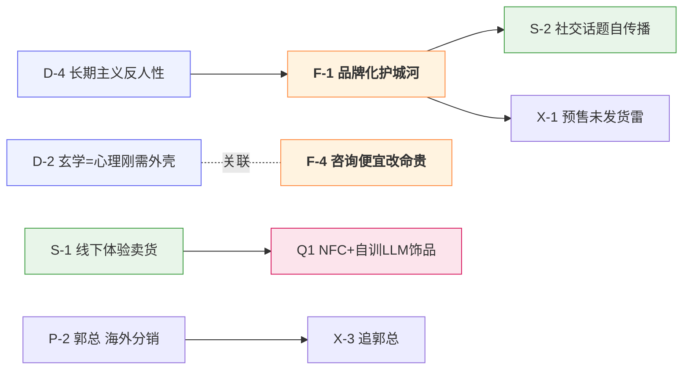

# 🧭 AI智能硬件业务交流午餐会 · 道法术器拆解

> [!info] 会议信息
> - 日期：2026-05-29 ｜ 时长：2h11m ｜ 场景：智能硬件午餐会（边吃边聊 + 嘉宾分享）
> - 妙记：https://vi8r050ecuz.feishu.cn/minutes/obcnv7zur8g7j3t5m6kc4ti5
> - ⚠️ 飞书原 AI 摘要把这场识别成了"客户购车 / 活动安排"，**完全没接住**。真正的信息点埋在饭局闲聊里——这正是道法术器要捞的东西。

## 📊 拆解看板

> 一桌 AI 硬件创业者的饭局：玄学饰品、声波睡眠灯、空气架子鼓、车载机器人各路混杂，中间插了一段百道数据（谷歌云代理）的 AI 销售分享。表面闲聊，底下是一整套「智能硬件 + 身心灵 + AI」的生意逻辑。

| 维度 | 条数 | 高价值 | 最该看的一条 |
|---|---|---|---|
| 🌌 道 | 4 | 2 | D-2 玄学的本质是心理刚需的商业化外壳 |
| 🧭 法 | 4 | 2 | F-1 品牌化是硬件抄不走的护城河 |
| 🛠 术 | 4 | 1 | S-1 线下体验式卖硬件（"一定要碰、要转一下"） |
| 🧰 器 | 4 | 1 | Q-1 NFC+自训LLM 做卦象 agent 饰品 |
| 👤 人/关系 | 5 | 2 | P-2 郭总：网易有道严选海外操盘手，能给美国线下分销 |
| 📡 信号/钩子 | 4 | 2 | X-1 698元×800台预售未发货=随时爆退货雷 |
| 💬 金句 | 4 | — | Y-3 "你卖的最贵的其实是改命" |

**今天最该被记住的 1 件事**：智能硬件不再拼参数，拼的是「品牌 + 情绪价值 + 线下体验」三件套；谁把硬件做成"能带出去、有社交话题、还能算一卦"的饰品，谁就跳出了价格战。

---

## 🌌 道（本质 · 底层判断 · 不变的规律）

- **`D-1` 硬件思维正在让位给服务思维**：一次性卖货（拼屏幕清晰、参数覆盖）是旧逻辑；AI 让设备"主动理解人、持续服务"，价值从硬件转向服务订阅。 `[来源:讲者讲(百道数据分享)]` `[价值:中]` `[时间:00:26:37]`
- **`D-2` 玄学/身心灵的本质，是心理刚需的商业化外壳**：中国人"不信迷信，只问神请神，哪个管事信哪个"——玄学背后接的是现代心理学和情绪刚需，不是迷信。情绪是刚需，刚需可被产品化。 `[来源:讲者讲]` `[价值:高]` `[时间:00:15:56 / 01:02:19]` `↔ 关联 F-4`
- **`D-3` "九子离火运"叙事 = 身心灵赛道的大势判断**：讲者用"九紫离火、经济周期、心理医生缺口（号称缺 600 万）"包装出一个"心理/疗愈需求爆发"的宏观叙事，给硬件找精神刚需的接口。 `[来源:讲者讲]` `[价值:中]` `[时间:01:02:19 / 01:10:04]` `→ 配合 S-4`
- **`D-4` 长期主义是反人性的，所以才是护城河**："说起来很简单，大家都想长期主义，但实际操起来很痛苦"——正因为痛苦、大多数人做不到，能扛住的就拉开了差距。 `[来源:讲者讲]` `[价值:低]` `[时间:01:06:50]`

---

## 🧭 法（策略 · 可迁移的方法论）

- **`F-1` 品牌化是硬件唯一抄不走的护城河**：玩法/功能能被像素级 copy，渠道和铺量也能堆，但"品牌细节、物料质感、颜值"堆出的认知抄不走。"我可以把品牌抄了，但品牌很多人不会每天（坚持做）。" `[来源:讲者讲]` `[价值:高]` `[时间:00:09:17 / 00:17:49]` `← 出自 D-4` `→ 配合 S-2`
- **`F-2` 单爆款 + 极窄 SKU**：不铺产品线，"现在就做一个爆款"，只做项链（手链/戒指都先压着），把 PMF 跑透再扩。SKU 越窄，品牌认知越锋利。 `[来源:讲者讲]` `[价值:中]` `[时间:00:18:37]`
- **`F-3` 方案商 vs 自有品牌是两种命**：做方案商（只负责生产、甲方管渠道营销）能在多个产品上复用经验、轻；做自有品牌只能押一个、但渠道营销全得自己扛、却有长久价值。选哪条要想清楚。 `[来源:讲者讲]` `[价值:中]` `[时间:01:08:09]`
- **`F-4` 玄学命理的"咨询便宜 + 内购贵"漏斗**：算命/咨询定价压到几百块（"对老板就是玩"）做获客，真正贵的是订阅式的"调运/改命"（案例：改运 800 万，改回去 1200 万）。低价诊断引流，高价"治疗"复购。 `[来源:讲者讲]` `[价值:高]` `[时间:01:14:07]` `↔ 关联 D-2`

---

## 🛠 术（具体动作 · 技巧 · 打法）

- **`S-1` 线下体验式卖硬件**："一定要碰、要转一下、要体验"——硬件+玄学必须现场演示，"展台上全是人"。线下转化远高于线上，所以主攻活动/展会/游艇会现场出单。 `[来源:讲者讲]` `[价值:高]` `[时间:00:13:00 / 00:14:17]` `→ 配合 Q-1`
- **`S-2` 用"社交话题性"驱动自传播**："社交的核心是 topic 得有趣"——把产品做成"拿出来给旁边朋友一起玩、能算一卦"的东西，本身就是钩子，"很好卖"。 `[来源:讲者讲]` `[价值:中]` `[时间:00:17:49]` `← 出自 F-1`
- **`S-3` 政府/文博会开场表演当营销入口**：空气架子鼓那家靠给广州/深圳政府活动、文博会、音乐节做开场表演获客；南通古城黑科技展"一天上百套"。把"表演"做成获客渠道。 `[来源:讲者讲]` `[价值:中]` `[时间:00:06:58 / 00:14:17]`
- **`S-4` 性别化 TA 切分**：女性 TA 很清晰——30 岁左右、会打扮、拎稍贵的包；男性多是"买来送人"或"有私域的专业渠道方做分销"。一个产品两套话术。 `[来源:讲者讲]` `[价值:中]` `[时间:00:15:10 / 00:15:56]`

---

## 🧰 器（工具 · 资源 · 数据 · 人脉渠道）

- **`Q-1` NFC + 自训 LLM 的卦象 agent 饰品**：硬件不走 PCB（全套充电、做轻做成饰品），靠 NFC 贴片 + 扫码网页 + 自己用"解码 LM"训练的卦象 agent；卖 500–698 元。技术不复杂，壁垒在品牌+体验。 `[来源:讲者讲]` `[价值:高]` `[时间:00:16:49 / 00:19:52 / 00:21:07]`
- **`Q-2` AI 算力/token 采购的三档选择**：企业版（合规、隐私安全、有品牌调性的产品用）＞ 代理商折扣（如谷歌云代理百道数据）＞ 中转平台（一折以下、但不保隐私、可能跑路）。选哪档取决于你 care 不 care 品牌和合规。 `[来源:讲者讲]` `[价值:中]` `[时间:01:04:39 / 01:05:09]` `→ 配合 P-4`
- **`Q-3` 智能硬件的线下场景资源池**：6 月上海/杭州游艇趴、深圳游轮场、保时捷车友会、文博会、音乐节、互联网大会——一整圈"高净值 + 体验式"的线下出单场。 `[来源:讲者讲]` `[价值:中]` `[时间:00:04:39 / 01:01:13]`
- **`Q-4` 对标参照物**：车载情绪机器人对标蔚来 NOMI（情绪价值、刹车律动音乐，但多数没做车机联动）；睡眠/声波疗愈对标 A4D（"马斯克、黄仁勋那圈硅谷在用"）。 `[来源:讲者讲]` `[价值:低]` `[时间:00:59:20 / 01:02:19]`

---

## 👤 人 / 关系（谁说的 · 立场 · 潜台词 · 对我的意义）

- **`P-1` 静哥**：本场关键召集人之一，原定到场但"太忙没来"。多人提及、且"好日子是他算着邀请的"——是这个圈子的节点人物。**对我**：想进这个智能硬件局，静哥是绕不开的入口。 `[来源:讲者讲]` `[价值:中]` `[时间:00:04:39 / 00:13:00]`
- **`P-2` 郭总**：今日分享嘉宾，前网易有道/严选海外负责人、一线操盘手，美国有线下实体店可做分销。**对我**：出海 + 美国线下分销资源的强节点，值得单独深聊。 `[来源:讲者讲]` `[价值:高]` `[时间:00:05:30]` `→ 信号 X-3`
- **`P-3` 严总（关爱科技）**：做声波疗愈/睡眠台灯，气质"像修行人"，主攻身心灵赛道。**对我**：身心灵硬件这条线的对标 + 潜在合作对象。 `[来源:讲者讲]` `[价值:中]` `[时间:01:01:13 / 01:02:19]`
- **`P-4` 百道数据 · 香启瑶（销售）**：谷歌云亚太区代理，主推生成式 AI 重塑硬件、"跳出价格战"，宣称服务 200+ 企业。**对我**：要采购合规 AI 算力/企业版 token 时的对接人。 `[来源:讲者讲]` `[价值:中]` `[时间:00:25:13]` `← 出自 Q-2`
- **`P-5` 玄学饰品创始人（卦象项链那位）**：30 人公司、技术部级别，品牌化打法清晰、对长期主义有真实体感。**对我**：智能硬件品牌化打法的最佳取经对象，这场含金量最高的一桌。 `[来源:我引申]` `[价值:中]` `[时间:贯穿全场]`

---

## 📡 信号 / 钩子（值得追的线索 + 待办）

- **`X-1` ⚠️ 预售未发货风险**：玄学饰品预售卖了 800+ 台（698 元/台）但"一直没发货、客户都想退货"，承诺 6 月中发货。**钩子**：这是观察"硬件创业现金流/交付翻车"的活案例，也提醒自己做硬件别盲目预售。 `[来源:讲者讲]` `[价值:高]` `[时间:01:00:32 / 00:19:14]`
- **`X-2` 行动**：把"道法术器拆解"做成 skill 自动跑——本场就是反例（AI 摘要废了）。完成判据：新妙记自动产出本文这种结构并三端归档。 `[来源:我引申]` `[价值:高]` `[时间:基于全场]`
- **`X-3` 待联系**：找郭总深聊美国线下分销 + 严选海外打法。目的：摸清出海硬件的美国落地渠道。 `[来源:我引申]` `[价值:中]` `[时间:00:05:30]` `→ 出自 P-2`
- **`X-4` 待验证**："中国心理医生缺口 600 万""九子离火运"这类宏观数字是销售叙事，半信半疑，需独立核实再用于自己的选题。 `[来源:讲者讲]` `[价值:低]` `[时间:01:10:04]`

---

## 💬 金句（讲者原话，保留原措辞）

> **`Y-1`** "它的使用场景跟产品场景往往比技术更重要。" `[来源:讲者讲]` `[价值:中]` `[时间:01:07:26]`
> 用法：硬件/AI 产品选题的公众号副标题。

> **`Y-2`** "长期主义这件事情，说起来很简单，大家都想长期主义，但实际操起来是很痛苦的一件事。" `[来源:讲者讲]` `[价值:中]` `[时间:01:06:50]`
> 用法：朋友圈短文案。 `← 出自 D-4`

> **`Y-3`** "你卖的最贵的其实是改命……改过来 800 万，改回去要 1200 万。" `[来源:讲者讲]` `[价值:高]` `[时间:01:14:07]`
> 用法：讲"低价获客 + 高价复购"商业模式的硬案例。 `← 出自 F-4`

> **`Y-4`** "年轻的时候看这些是为了谈女朋友，现在这个年纪去看 MBTI，是为了招 00 后员工。" `[来源:讲者讲]` `[价值:中]` `[时间:01:11:36]`
> 用法：短视频开场钩子 / 代际洞察选题。

---

## 🔗 资产关系图

---

## 🗺 五类资产映射表

> 这张表把"道法术器"换算成 sk-info-assets 的「五类信息资产」视角——同一批料、另一个抽屉。**如果你看完觉得用不上，跟我说一声就砍掉，skill 里不强制生成。**

| 五类资产 | 本场对应的道法术器条目 | 一句话 |
|---|---|---|
| ① 复盘（讲了什么） | D-1～D-4 + 看板 | 智能硬件饭局：硬件→服务、玄学→心理刚需 |
| ② 业务启发（改我的产品/打法） | F-1 品牌化护城河、F-2 单爆款、S-1 线下体验 | 做硬件先想品牌和线下体验，别拼参数 |
| ③ 内容素材（能发出去的） | Y-1～Y-4 金句 + D-2 玄学洞察 | 至少 3 条可直接用的选题/文案 |
| ④ 方法与工具（可沉淀复用） | Q-1 技术栈、Q-2 token 采购三档、F-4 漏斗 | token 采购决策表 + 玄学变现漏斗 |
| ⑤ 行动与问题（要做/要问） | X-1～X-4 信号钩子 | 追郭总、做 skill、核实数字、盯发货雷 |

---

> 拆解纪律：本文严格区分「讲者讲」与「我引申」，无逐字稿支撑处不编造；价值评级走三步决策树（本篇 高 7/29 ≈ 24%，低 5/29 ≈ 17%，在健康区间）。
