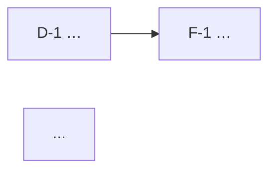

# 道法术器拆解 · 输出模板

> 骨架是「道·法·术·器·人/关系·信号/钩子·金句」七维。每条资产强制带稳定 ID + 三标签，价值评级走三步决策树。本模板嫁接自 sk-info-assets 的机制，但分类法是道法术器。

## 七维定义（拆解时对照判断）

| 维度 | 回答的问题 | 收什么 | ID 前缀 |
|---|---|---|---|
| 🌌 道 | 为什么？本质是什么？ | 底层判断、不变的规律、价值观、核心概念释义 | `D-` |
| 🧭 法 | 用什么思路？什么框架？ | 策略、可迁移的方法论、原则、商业模式 | `F-` |
| 🛠 术 | 具体怎么做？ | 具体动作、技巧、话术、SOP、打法 | `S-` |
| 🧰 器 | 用什么实现？ | 工具、软件、资源、数据、平台、可调用人脉渠道 | `Q-` |
| 👤 人/关系 | 谁？什么立场？ | 谁说的、背景与可信度、潜台词、想要什么、对我的意义 | `P-` |
| 📡 信号/钩子 | 接下来追什么？ | 值得事后追的线索 + 待办（带完成判据/负责人） | `X-` |
| 💬 金句 | 哪句原话值得留？ | 讲者原话凝练，保留原措辞 | `Y-` |

记忆口诀：**道是方向，法是路线，术是车技，器是车；人是同路人，信号是路标，金句是沿途的碑。**

## 三标签（每条强制）

| 标签 | 取值 | 说明 |
|---|---|---|
| `[来源]` | 讲者讲 / 我引申 / 他人问 | 区分一手 vs 衍生，防止把脑补冒充原话 |
| `[价值]` | 高 / 中 / 低 | 走下面三步决策树，不凭感觉 |
| `[时间]` | HH:MM:SS 或区间 | 可回查锚点；无法定位写"（无锚点）" |

## 价值评级三步决策树

```
Step 1 行动判定：这条会让我【下周内】做或改某件具体事吗？
  YES → Step 2     NO → Step 3
Step 2 杠杆判定：能让我【未来多次复用】(≥3次产出/沉淀成可重用工具)吗？
  YES → [价值:高]  NO → [价值:中]
Step 3 认知判定：它【推翻或大幅修正】了我之前的判断吗？
  强 YES → [价值:中]  弱 NO → [价值:低]
```

全篇校准：`[价值:高]` ≤ 30%、`[价值:低]` ≥ 20%。超标就提高杠杆门槛重筛。

## 交叉引用

- `→ 配合 Q-1`：这条要用上 Q-1 才能落地
- `← 出自 D-2`：这条源头是 D-2
- `↔ 关联 F-3`：互相印证或并列

强制：信号 X 里的"待办"若依赖某工具 → 必挂 `→ 配合 Q-x`。

---

## 完整文件骨架

````markdown
---
type: meeting-digest
date: YYYY-MM-DD
meeting: 会议标题
duration: 2h11m
场景类型: [AI硬件|知识|人情世故|大佬分享|饭局闲聊]   # 可多选
minute_token: obcnXXXX
minute_url: https://xxx.feishu.cn/minutes/obcnXXXX
base_record_id: recXXXX      # 收口后回填
doc_url: https://...          # 收口后回填
github_url: https://...       # push 后回填
tags: [会议纪要, 拆解, 道法术器]
---

# 🧭 {会议标题} · 道法术器拆解

> [!info] 会议信息
> - 日期：YYYY-MM-DD ｜ 时长：… ｜ 场景：…
> - 妙记：{minute_url}

## 📊 拆解看板
> 一句话定位这场会。

| 维度 | 条数 | 高价值 | 最该看的一条 |
|---|---|---|---|
| 🌌 道 | n | m | D-x … |
| 🧭 法 | n | m | F-x … |
| 🛠 术 | n | m | S-x … |
| 🧰 器 | n | m | Q-x … |
| 👤 人/关系 | n | m | P-x … |
| 📡 信号/钩子 | n | m | X-x … |
| 💬 金句 | n | — | Y-x … |

**今天最该被记住的 1 件事**：……

## 🌌 道（本质 · 底层判断 · 不变的规律）
- **`D-1` 标题**：内容。 `[来源:…]` `[价值:…]` `[时间:…]` `↔ 关联 …`

## 🧭 法（策略 · 可迁移的方法论）
- **`F-1` 标题**：内容。 三标签 + 交叉引用

## 🛠 术（具体动作 · 技巧 · 打法）
- **`S-1` 标题**：内容。 三标签

## 🧰 器（工具 · 资源 · 数据 · 人脉渠道）
- **`Q-1` 标题**：内容。 三标签

## 👤 人 / 关系（谁说的 · 立场 · 潜台词 · 对我的意义）
- **`P-1` 姓名/角色**：背景与可信度、潜台词、对我的意义。 三标签

## 📡 信号 / 钩子（值得追的线索 + 待办）
- **`X-1` 标题**：线索/待办（带完成判据）。 三标签 `→ 配合 Q-x`

## 💬 金句（讲者原话，保留原措辞）
> **`Y-1`** "原话。" `[来源:讲者讲]` `[价值:…]` `[时间:…]`
> 用法：……

## 🔗 资产关系图   （交叉引用 ≥ 3 条时）


## 🗺 五类资产映射表   （config.emit_asset_map=true 时）
| 五类资产 | 对应道法术器条目 | 一句话 |
|---|---|---|
| ① 复盘（讲了什么） | 道 + 看板 | … |
| ② 业务启发 | 法、部分术 | … |
| ③ 内容素材 | 金句 | … |
| ④ 方法与工具 | 器、部分法 | … |
| ⑤ 行动与问题 | 信号/钩子 | … |

> 拆解纪律：严格区分讲者讲/我引申；无逐字稿处不编造；价值评级 高 x% 低 y%，在健康区间。
````

完整真实样例见 `../examples/sample-AI硬件午餐会.md`。
